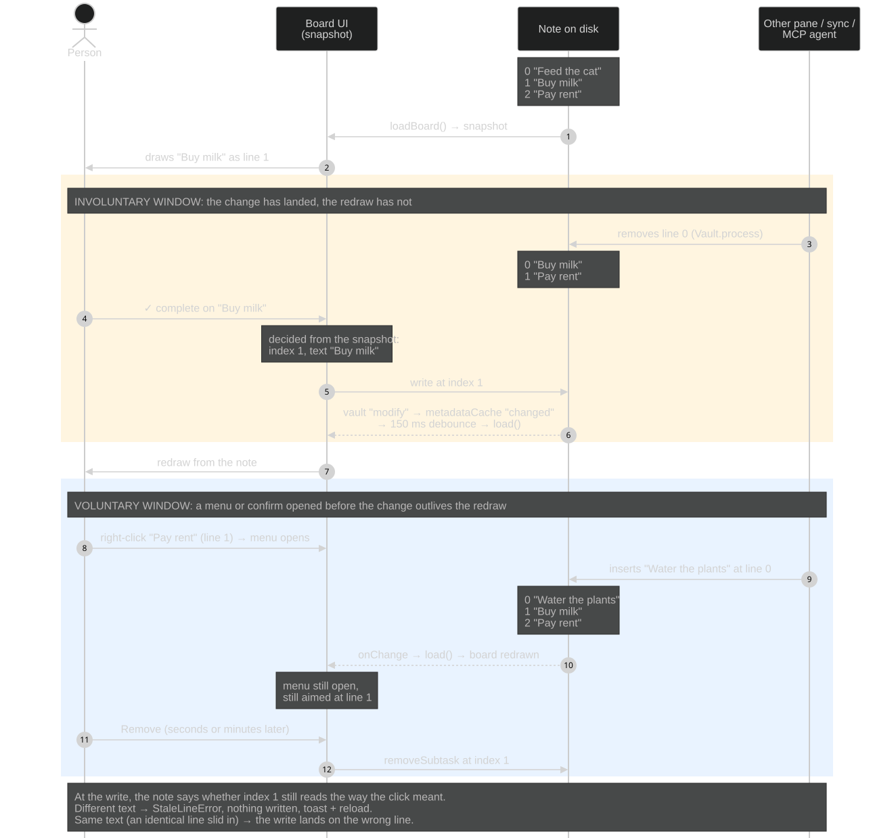

# How often can the stale-reading bug family actually happen?

This report estimates how often the stale-reading bugs in folia-kanban's checklist handling can really happen, and what a proposed hardening would change. It concerns four GitHub issues: [#36](https://github.com/stavarengo/folia-kanban/issues/36) (a checklist line's `[status:: …]` can be overwritten by a click decided before it was written), [#37](https://github.com/stavarengo/folia-kanban/issues/37) (sending a todo to another column can do nothing at all, without saying so), [#50](https://github.com/stavarengo/folia-kanban/issues/50) (the right-click menu on a checklist line can act on a different line than the one it was opened on), and [#51](https://github.com/stavarengo/folia-kanban/issues/51) (the "Remove todo?" confirm on a placed-todo tile keeps naming the line that has since left the tile), of which only #51 was still open. It was written against `main` at the 0.3.2 release, after the fixes in 120f458, 48910d4 and ebcda15, by reading the code and Obsidian's own type definitions. Nothing was run in a live Obsidian and there is no telemetry, so every frequency below is reasoned inference with its assumptions stated.

## Conclusion

For losing or misplacing data, what is left on `main` is rare, but it is not only freak coincidences.
Three silent wrong outcomes remain on the checklist path.
The first is a drag of a placed todo while another writer shifts the lines above it: the board reloads during the drag, the old index now names a different line, and that line is moved with no refusal.
The second is identical twin lines in one card plus a shift above them under a stale reading (the #36 residue).
The third is a column claim written in the few milliseconds between two reads inside a single tick.
The drag case is the one that matters most, because it needs no twin and no millisecond timing: only a shift-inducing write (sync, a direct file edit, an agent with file access) landing during the seconds a drag is in progress, which is still rare.
The same index-only path is reachable through the MCP `move_card` tool when an agent names a placed todo by its `Note.md#todo:N` path and the person removes a line above it during the agent's think time.
The same drag path also overwrites, without refusal, a claim another writer changed during the drag; that is last writer wins on the right line, not a misplaced write.
Almost everything else in the family ends in a refusal toast and a reload, which is a nuisance, not data loss.
For a solo user on one device it is close to impossible, because nothing else shifts lines while they drag.
The most likely real-world trigger of any outcome is still an agent ticking or placing a line (which moves its `[status:: …]` claim) while the person has a right-click menu open on that same line and then picks a column from it; that ends in a refusal toast.

## 1. The windows

### How the board learns of a change (involuntary window)

`VaultRepository.onChange` listens to the vault's `modify`, `create`, `delete` and `rename` events and to `metadataCache.on("changed")` (`src/obsidian/vaultRepo.ts:1002-1020`).
Every trigger goes through a 150 ms trailing debounce that restarts on each new event (`vaultRepo.ts:989-993`).
`App` subscribes with `repo.onChange(() => void load())` (`src/ui/App.tsx:232-236`), and `load` drops any result superseded by a newer load (`App.tsx:214-230`).
`loadBoard` re-reads the board config and then every card in the card folder one by one with `cachedRead`, parsing subtasks and stats for each, then runs `buildBoard` and `loadContexts` (`vaultRepo.ts:302-386`).
Inference: for boards of tens to a few hundred cards that is roughly tens to a few hundred milliseconds, so the board redraws about 0.2 to 0.5 s after Obsidian reports the change, growing with board size.
Because the debounce restarts on every event, a sustained burst (a sync pulling many files at once) holds the redraw back until 150 ms of quiet, which can stretch the window to the length of the burst.

The 2500 ms echo guard, which drops vault events on paths this repository just wrote (`vaultRepo.ts:994-1001`), does not widen the window for card notes: the `metadataCache` listener reloads for any file under the card folder regardless (`vaultRepo.ts:1015-1020`), and Obsidian fires `changed` whenever a file has been re-indexed (`node_modules/obsidian/obsidian.d.ts:4446-4453`).
MCP writes never hit the guard anyway, because the MCP server builds a new `VaultRepository` per call (`src/obsidian/mcpService.ts:106-113`) and `recentWrites` is per instance (`vaultRepo.ts:128`), so every agent write reloads the open board.

Upstream of all this is how quickly Obsidian notices a change made outside it, which the code cannot show; the plugin only uses `vault.on(...)` and checks for `FileSystemAdapter` to get a path (`vaultRepo.ts:965-970`).
Not verified in the code, and taken as an assumption: desktop Obsidian uses filesystem events and usually sees an outside edit within about a second, mobile tends to notice on returning to the foreground, and Obsidian Sync writes through the vault so events fire as each file lands.

### What each surface captures, and how long it holds it (voluntary windows)

Two groups of surfaces behave differently.
Surfaces that capture a reading of the line when they open: the right-click menu, the tile's "Remove todo?" confirm, the detail panel row (column dropdown, checkbox and × remove) and MCP `set_subtask_done`.
Surfaces that capture nothing and send only an index: dragging a placed todo, the tile's ✓ complete button on a placed todo, and MCP `move_card` on a placed todo.

Right-click menu: reads the line when it opens (`readTodo` at `src/ui/CardItem.tsx:156-167`) and nothing re-reads it later.
It closes on any `pointerdown` outside it in the same document (`src/ui/CardContextMenu.tsx:109-115`) or on Escape; its keyboard handler has no Tab handling and no focus trap (`CardContextMenu.tsx:117-134`), so a keyboard user can leave it open indefinitely.
The one to five seconds used below is an assumption about ordinary hesitation, not a bound the UI enforces.

"Remove todo?" confirm: reads the line when it opens (`CardItem.tsx:436`) and closes only through its own buttons (`CardItem.tsx:445-475`), so it can stay open for minutes while the person edits elsewhere.

Detail panel: re-reads the note on every board reload (`src/ui/CardDetail.tsx:1092-1103`) and keeps that body as its reading.
Its checkbox passes the row's `SubItem` to `setSubtaskDone` (`CardDetail.tsx:1826-1843`), its column dropdown passes it to `moveTodo` (`CardDetail.tsx:1900-1903`), and its × button calls `repo.removeSubtask(path, { index, text })` from the same cached row (`CardDetail.tsx:1920-1926`).
All three are stale only by the involuntary window, all three refuse ordinary drift through the repository guard, and all three share the twin-lines-plus-shift residue.

Drag of a placed todo: the drag id is `parent#todo:index` (`src/model/board.ts:40-48`), fixed when the drag starts, and the drop forwards it (`src/ui/Board.tsx:339-359`).
`onMove` then takes the newest board (`App.tsx:345-365`), and `moveCardTo` → `moveCard` → `moveSubtask(board, parent, { index })` resolves whatever line the current board draws at that index (`board.ts:1344-1355`, `1036-1047`).
The mutation's text and claim come from that line (`board.ts:1068`, `1082-1085`), so the guard inside the write compares the note against a reading of the very line it is about to move.
If the board did not reload during the drag, that reading is as old as the last reload and a changed line is refused.
If it did reload after a shift, the drag lands on the shifted line silently; if the line now at that index is not a placed todo, the board has no such card and nothing is written.
The window is the length of the drag, typically one to a few seconds.

Tile ✓ complete on a placed todo: goes `complete` → `moveTo` → `moveCardTo` with the same index-only identity (`App.tsx:548-555`, `398-411`).
The tile's path and the board it is resolved against come from the same render (`boardRef.current = board` at `App.tsx:210`), so they are stale together and a changed line is refused.
The residual risk is a redraw landing in the instant between the person aiming and clicking, which moves what is under the cursor; that is a generic UI hazard rather than this family.

MCP agent: stale between its `get_card` or `get_board` and its write, seconds to minutes of the agent's think time.
`set_subtask_done` re-checks index and text against a fresh `readBody` inside the call (`src/mcp/cardTools.ts:424-438`).
`move_card` loads a fresh board and resolves the card reference (`cardTools.ts:254-272`): a raw `Note.md#todo:N` path is taken as is (`src/mcp/tool.ts:104`), so the agent's earlier reading never reaches the write and a shifted index moves whichever placed todo now sits there; a reference by the line's title is matched by text on the fresh board (`tool.ts:106-111`), so a shift cannot mislead it and twins get an "names N cards" error.

### The two windows on one timeline

The amber band is the involuntary window: the note has changed but the board has not redrawn yet, so a ✓ complete on "Buy milk" is decided from the old snapshot, the write carries the old index and text, the note no longer matches, and nothing is written.
The blue band is the voluntary window: a right-click menu opened before the change stays open across the redraw and still aims at line 1, so its Remove is refused unless an identical line slid into that position.
Drag is not on this timeline because its danger runs the other way, a redraw that lands during the drag, which the diagram in section 3 shows.

## 2. The writers

The same person in another pane or in the board itself: cannot reach an open menu with the mouse (the click closes it), can reach an open confirm, cannot beat the involuntary window by hand, and cannot shift lines during their own drag.
They can shift lines while an agent thinks, though: the board's own Remove todo (menu, confirm, panel ×) and the note editor both remove or insert checklist lines.

Sync (Obsidian Sync, iCloud, Syncthing, git): brings edits from another device that for a solo user is usually idle, arriving mostly at app start, and it can shift lines.
An external editor, script or coding agent with file access: rare for most users, but it can do anything, including shifting lines during a drag.

The plugin's MCP server: none of its writing tools removes, inserts or reorders a checklist line (the tools are `create_card`, `move_card`, `update_card`, `add_comment`, `add_subtask`, `set_subtask_done` in `cardTools.ts`; `src/mcp/boardTools.ts` only reads), and `add_subtask` appends at the end of the section (`src/model/card.ts:489-491`), so existing indexes never move.
`set_subtask_done` changes a box and moves a claimed column to Done (`src/model/boardOps.ts:67-101`), and `move_card` on a placed todo rewrites its claim; calls run one at a time (`docs/mcp.md:123`), each a few writes folded by the debounce into one reload.
An agent working through a card's subtasks writes to that card every few seconds to a minute, on exactly the card a person is likely watching, so it can change claims and boxes under an open menu or a drag, but never shift the line under them.

The plugin's own follow-up writes: a tick is two writes, box then claim (`boardOps.ts:80-94`), and only another writer landing between them interferes.

## 3. What still goes wrong after the fixes

### How the guard works today

The repository interface already requires a `LineRef` (`index` + `text`) on `toggleSubtask` and `removeSubtask` (`src/model/repo.ts:130-131`), and every checklist write goes through `editLine`, which checks inside the atomic `Vault.process` and hands the note back untouched on drift (`vaultRepo.ts:477-496`).
The optional part is higher up: `toggleTodo`, `removeTodo` and `moveTodo` in `src/ui/context.ts:240-253`, and `moveSubtask(at: { index, line? })`, fall back to `subtaskRef(board)` or the board's drawn line when the caller sends no reading (`App.tsx:687`, `726`, `782`; `board.ts:1045-1046`).
So the guard is never skipped; the failure mode is that it compares against a reading that may already be of the shifted line.
`claim` is optional on purpose (`src/model/types.ts:60-71`): a tick re-reads the claim inside the write (`claimInStep` in `applyMove`, `vaultRepo.ts:518-545`), and making it mandatory would refuse ticks whose claim changed underneath, which #36 chose not to do.

Green surfaces (right-click menu, tile confirm, detail panel row with its dropdown, checkbox and ×, MCP `set_subtask_done`) capture a reading when they open, and `editLine` compares the note against it inside `Vault.process`.
Amber surfaces (drag and ✓ complete on a placed todo, MCP `move_card` by path) send only an index, and `moveSubtask` fills in the text and claim from whatever line the current board draws there.
The guard is never skipped, but for drag, and for `move_card` by path, the index outlives the reading: the board reloads (or MCP loads it fresh) after a shift, so the guard compares the note against the shifted line itself, which is the lower red exit on the right.
✓ complete does not reach that exit: its path and its board come from the same render, so they go stale together and a changed line is refused.
The upper red exit is the twin residue that any index-plus-text check shares.

### Refusal with a toast and a reload (nuisance, nothing written)

- A menu, confirm or panel action (checkbox, dropdown, ×) whose line no longer carries the same words at that index, because a line was removed, inserted above or reworded; pinned by the tests "will not tick / remove / give a column to the todo that slid into the place of the one its menu was raised on" and "…its confirm was raised on" (ebcda15).
- A hand-picked column (menu or panel dropdown) when the line's claim changed since it was read: `moveSubtask` names the claim it replaces (`board.ts:1079-1085`, `types.ts:60-71`), and `subtaskDrift` refuses when it differs (`card.ts:423-429`).
- A drag or ✓ complete decided on a board that has not yet redrawn after a change to that line: the index and its text are both from the older board, so the note refuses.
- A tick whose second write lands after another edit: the box stays written and the toast says the claim was not kept in step (`boardOps.ts:92-98`).
- An agent's `set_subtask_done` against a card that changed since `get_card` (`cardTools.ts:434-438`, `451-456`).

### Correct outcome, no refusal

A tick on a line whose claim moved underneath, because a tick sends no claim (`types.ts:66-69`) and the follow-up is decided from the note when it lands (test "ticks a line somebody moved to another column, and sends it to Done from there", 120f458).

### Silent overwrite (the #36 guard does not apply)

A drag of a placed todo whose claim changed during the drag with no shift: the reloaded board supplies the new claim as the value to replace, so the guard passes and the drop overwrites a claim the person may never have seen.
This is the lost update #36 refuses for the menu and the dropdown; for drag it is last writer wins, on the right line.

### Silent no-op by design

Picking, from a stale reading, the column that reading already shows as current writes nothing even if the note now says something else (`App.tsx:746-767`; test "stays quiet when a claim arrives under the menu on a todo sent back to its card", ebcda15).
The reload then shows the line where the note really has it, so nothing is lost, but the person gets no message.

### Silent wrong outcome (the part that matters most)

- Index-only move after a shift: a drag of a placed todo, or MCP `move_card` naming a placed todo by its `#todo:N` path, when a line above was inserted or removed and the board was reloaded (or, for MCP, loaded fresh) before the write. The move lands on whatever placed todo now sits at that index, with no twin needed and no refusal, because its text and claim are read from that same line. The reload shows the wrong line in the new column, so it is visible, but nothing says so.
- Identical twins plus a shift (#36 residue): the guard compares words at an index, so if a card has two lines reading exactly the same and a line is added or removed above them under a stale reading (menu, confirm, panel row, `set_subtask_done`), the action lands on the twin. The file only ends up visibly different if the twins differed in box or claim.
- The claim-sync read-then-write gap: `applyMove` reads the line once to skip a no-op, and a claim written in the single await between that read and the decision is not seen, leaving the line ticked but claiming a column the tick would have moved (`vaultRepo.ts:527-543`, which states this in its own comment).

Cosmetic: the confirm's label can name the line that slid under the tile rather than the one it acts on (#51, still open at 0.3.2).

Outside the four issues, frontmatter writes from the panel (priority, assignee, due, a subcard's column at `CardDetail.tsx:1884-1898`) are last-writer-wins with no reading check (`vaultRepo.ts:443-462`), which is ordinary editor behaviour for an explicit choice.

## 4. The estimate

Assumptions, stated once:

- A person does 20 to 50 checklist actions a day on the board, a few of them drags of placed todos lasting 1 to 3 s each; a menu or column choice is open 1 to 5 s (assumed, not enforced by the UI); a confirm usually 1 to 3 s but occasionally forgotten for minutes.
- Chance an action overlaps a foreign write ≈ (foreign writes per second to that card) × (window), and it only matters when that write changes the specific thing the action depends on.
- Synced solo user: the card being acted on receives 0 to 5 remote edits a day, bunched at app start, and 10 to 30 % of those remove or insert a line above the target or change its claim.
- Agent alongside the board: while the agent works the card the person is watching, it writes every 5 to 60 s, and the person acts on the same line the agent touched in 5 to 20 % of their actions on that card.
- Identical twin lines exist in a small minority of cards (templated checklists such as "Test", "Review").

| Scenario | Precondition | Window | Writers who can trigger it | Solo, one device | Synced, several devices | Agent via MCP alongside board | Consequence |
|---|---|---|---|---|---|---|---|
| Line shifted during a drag of a placed todo (index only) | A line inserted or removed above the dragged todo, the board reloads before the drop, and the line now at that index is also a placed todo | The drag, 1–3 s | Sync, external script, file-editing agent, popout or other device | Never | Rare: a remote shift has to land mid-drag, well under once a year | Never through MCP tools (they only append) | Silent: another line is moved |
| Line shifted before MCP `move_card` by `#todo:N` path | The person or another writer removes or inserts a line above the placed todo during the agent's think time | Seconds to minutes | The person (Remove todo, editor), sync, external script | n/a | n/a | Occasional during co-working if the agent uses paths and the person removes lines | Silent: another line is moved |
| Line shifted under an open menu (#50) | A line removed or inserted above the target, or the target reworded | 1–5 s assumed, closes on any pointer-down; a keyboard user can hold it open indefinitely | Sync, external script, file-editing agent, popout or other device | Effectively never | Under once a year to a few times a year | Never through MCP tools (they only append) | Refusal toast |
| Line shifted under an open confirm (#50, #51) | Same as above | Until the button is pressed, can be minutes | Same, plus the person in another pane | A few times ever, self-inflicted | Rare, a few a year at most | Never through MCP tools | Refusal toast, dialog label names another line |
| Line shifted under the detail panel (checkbox, dropdown, ×) | Same as above, before the panel re-reads | ≈ 0.2–0.5 s plus choice time | Sync, external script, the person in another pane | Effectively never | Very rare | Never through MCP tools | Refusal toast |
| Drag or ✓ complete before the redraw | The line changed and the board has not redrawn yet | ≈ 0.2–0.5 s | Any | Never | Very rare | Rare | Refusal toast |
| Claim moved, then a hand-picked column (#36) | The line's claim changed since the menu or dropdown read it | Menu 1–5 s; dropdown ≈ 0.2–0.5 s plus choice time | Agent tick or `move_card`, sync, other pane | Effectively never | Rare | Plausible: 0 to a few per hour of co-working on the same card | Refusal toast |
| Claim moved during a drag, no shift | The dragged line's claim changed and the board reloaded before the drop | The drag, 1–3 s | Agent tick or `move_card`, sync | Never | Rare | Occasional | Silent overwrite of the new claim, right line |
| Claim moved, then a tick | Same | Same | Same | Never matters | Never matters | Common but harmless | Correct, claim follows the note |
| Stale menu picks the column it shows as current (#37 follow-up) | Claim or box changed to something else, person picks the value they saw | Menu 1–5 s | Same as the #36 row | Effectively never | Very rare | Rare, rarer than the #36 row because re-picking the current value is unusual | Silent no-op, reload shows reality |
| Write lands between a tick's two writes | Another write to that line in a few ms | Milliseconds | Any | Never | Extreme edge | Extreme edge | Toast: box written, claim not |
| Claim-sync read gap | A claim written onto that line in one await | Milliseconds | Any | Never | Extreme edge | Extreme edge | Silent: box right, claim out of step |
| Identical twins plus a shift (#36 residue) | Twin lines in one card and a shift above them under a stale reading | Same as the shift rows | Only writers that can shift lines | Never | Product of a rare shift and rare twins: essentially never | Never through MCP tools | Silent: acts on the twin |
| Agent's own stale reading, `set_subtask_done` | Person edits the checklist between the agent's `get_card` and its write | Seconds to minutes | The person, sync | n/a | n/a | Occasional during co-working | Tool refusal, agent re-reads (twins aside) |
| Frontmatter or order written from an old view (outside the family) | Someone else set the same field meanwhile | ≈ 0.2–0.5 s, or panel open time for the value shown | Any | Never | Rare | Occasional | Last writer wins, explicit choice kept |

Direct answer: the scenarios that can put the wrong thing in a note are still rare, but they are not all extreme edge cases.
The claim-sync gap and the twin residue are truly extreme.
The index-only move after a shift is merely rare: it needs a shifting writer and an active drag, or an agent using `#todo:N` paths while the person removes lines, and when it happens nothing refuses.
What is not an edge case at all is the refusal toast when an agent works the same card a person is handling, driven by the claim changes an agent's ticks and moves make; its cost is a toast and a retry, not lost work.

## 5. What would change the numbers

An agent ticking many subtasks in a loop on an open board raises the claim-refusal rate in proportion to how often the person places those same lines, but still cannot shift lines.
Agents that edit note files directly instead of using the MCP tools, or a future MCP tool that removes, inserts or reorders lines, would move the drag scenario and the shift scenarios, and with templated checklists the twin residue, from "rare" or "never" to "occasional".
A person who removes todos while an agent is moving placed todos by path is the one co-working pattern that reaches a silent outcome without any file-editing writer.
Several people sharing one vault through sync turn "the other device is idle" into real concurrent editing and multiply the synced column, including drags.
Mobile, if it only notices outside changes on returning to the foreground, stretches the involuntary window to however long the app was in the background.
A keyboard user who leaves a menu open stretches the menu window from seconds to however long they leave it.
None of Obsidian's file-watch latencies were verified here, and no scenario was reproduced in a live Obsidian, including the mid-drag reload.

## 6. Implications for the proposed hardening

The proposed hardening is one required captured reading (index, text, claim, occurrence) and one chokepoint inside `Vault.process`; nothing gets written into people's notes, so block IDs are out.
This section describes what the findings above mean for it, without deciding.

Every surface, drag and MCP included, captures index, text and occurrence (plus the claim) up front, and the repository resolves that reading in one place inside `Vault.process`, so the amber paths disappear.
The claim is still compared only for a hand-picked column; a tick keeps deciding its claim inside the write with `claimInStep`.
The red box is the narrow twin case that occurrence counting leaves, explained below.

Drag and ✓ complete would have to capture the line at drag start or at render and carry it into `moveCardTo` → `moveSubtask`, instead of resolving the index against the board at drop time; that alone closes the index-only silent outcome for the UI.
The MCP side needs two changes to reach the same guarantee: `get_card` (and `get_board` for placed todos) reporting each line's occurrence, and `move_card` accepting the line's text and occurrence the way `set_subtask_done` already accepts index and text.
`claim` stays optional for ticks, for the reason #36 settled: the tick's follow-up is decided inside the write.
Counting occurrences does not fully close the twin case: a twin inserted directly above the meant line, or the meant line deleted with a twin directly below it, leaves the same text at the same occurrence count, so the check passes and the write lands on the twin.
Without writing identifiers into notes, that last case can be narrowed (for example by also comparing neighbouring lines) but not eliminated.
